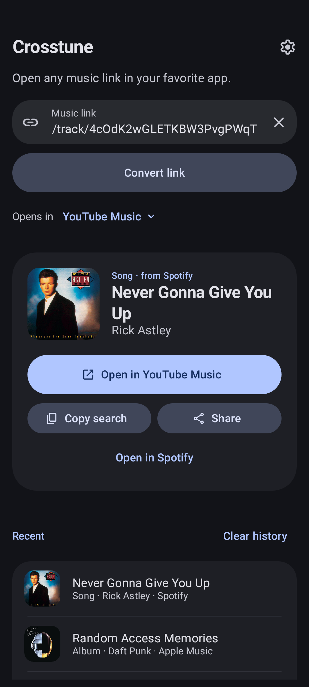
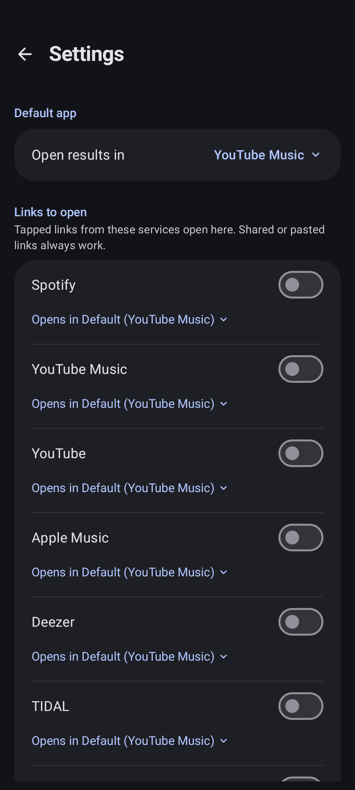
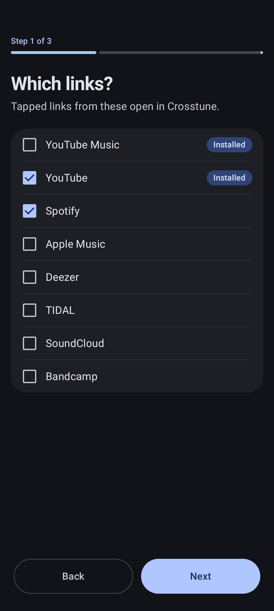

# Crosstune

**Open any music link in your favorite app.**

Someone sends you a Spotify link, but you listen on YouTube Music. With Crosstune, you tap the link and the same song opens in YouTube Music. Albums, artists and playlists work too.

<p align="center">
  
  
  
  
</p>

## ⬇️ Install

Crosstune runs on Android 8.0 or newer.

- Download the APK from [Releases](https://github.com/astrovm/crosstune/releases).
- Or get updates automatically: add `https://github.com/astrovm/crosstune` to [Obtainium](https://github.com/ImranR98/Obtainium).

## 🚀 Set up

Setup takes about a minute.

1. Open Crosstune and pick the services people send you links from.
2. Pick the app you listen in.
3. Tap **Open link settings**, then **Add link**, and turn on every link Crosstune lists.

That's it. Music links you tap now open in your app.

You don't have to set up anything to paste a link into Crosstune or share one to it. That works with every service.

## How it works

Crosstune reads the link's title and artist from the service it comes from, then searches for them in your app. Links you tap or share open straight away. Links you paste into Crosstune show the song and its cover first.

## Features

- **9 services.** Crosstune reads links from Spotify, YouTube Music, YouTube, Apple Music, Deezer, TIDAL, SoundCloud and Bandcamp. It opens them in any of those, or in Amazon Music.
- **One app per service.** Send YouTube links to YouTube Music and everything else to Apple Music, for example.
- **Ask every time.** Choose the app each time you tap or share a link.
- **Exact match.** Apple Music and Deezer can open the song, album or artist itself instead of a search.
- **Any app or site.** Add your own, as long as it has a search page. Write `{query}` where the song name goes, like `https://example.com/search?q={query}`.
- **Shortcuts.** Paste with one tap, reopen recent links, use the Quick Settings tile, or long-press the app icon to open a copied link.

## Supported links

| Service | Links |
| --- | --- |
| Spotify | Songs, albums, artists, playlists, `spotify.link`, `spotify:` URIs, track IDs |
| YouTube Music | Songs and videos |
| YouTube | Videos, Shorts, live streams, `youtu.be` |
| Apple Music | Songs, albums, artists, playlists |
| Deezer | Songs, albums, artists, playlists, `link.deezer.com` |
| TIDAL | Songs, albums, artists, playlists |
| SoundCloud | Tracks, artists, sets, `on.soundcloud.com` |
| Bandcamp | Tracks, albums |

Crosstune can't read Amazon Music links, YouTube playlists or YouTube channels. Their pages don't include the song details. You can still pick Amazon Music as the app songs open in.

## 🛠️ Troubleshooting

**Links still open in another app or the browser.**
In Crosstune's **Settings**, turn the service on under **Open links from**. Then go to Android's **Settings → Apps → Crosstune → Open by default**, tap **Add link**, and turn on that service's links.

**A link opened in its own app.**
Some pages, like a SoundCloud feed, aren't a song, album, artist or playlist. Crosstune can't read those, so it passes them to that service's app.

**I got a search, not the song.**
Most apps don't offer a public way to find a song without an account, so Crosstune searches for it by title and artist. If you use Apple Music or Deezer, turn on **Open the exact match**.

## Privacy

- No account, no analytics, no ads.
- Your history stays on your device.
- To show a link's title, artist and cover, Crosstune asks only the service the link comes from, through its public page or public API. Covers load from that service's image servers.
- With **Open the exact match** on, the title and artist are also sent to [Apple's](https://performance-partners.apple.com/search-api) or [Deezer's](https://developers.deezer.com/api) search API.

<details>
<summary><b>Verify your download</b></summary>

Release APKs are signed with this certificate. Its SHA-256 fingerprint is also listed on each release:

```text
64:EC:D5:52:E3:4B:B4:15:8A:04:6B:DE:1B:BD:BC:C9:04:23:9D:59:33:CF:74:C4:62:B6:FD:02:A7:B0:F6:FA
```

</details>

<details>
<summary><b>Building from source</b></summary>

You need the Android SDK and JDK 17 or newer. When building from the command line, set `sdk.dir=/path/to/Android/Sdk` in `local.properties`.

```bash
./gradlew :app:assembleDebug   # APK in app/build/outputs/apk/debug/
./gradlew :app:ci              # the same checks CI runs
```

`:app:ci` runs the Robolectric tests with a 100% line coverage gate, lint, and the debug and minified release builds. Reports go to `app/build/reports/`.

The version comes from Git. `versionName` is the latest tag without the `v`, plus `-dev.N` for commits after it. `versionCode` is the commit count.

### Releasing

1. Push a tag with `git tag vX.Y.Z && git push origin vX.Y.Z`, or run **Actions → Release → Run workflow**.
2. The [Release workflow](.github/workflows/release.yml) runs the CI checks, then signs and publishes `Crosstune-vX.Y.Z.apk`.

It needs these repository secrets:

| Secret | Value |
| --- | --- |
| `RELEASE_KEYSTORE_BASE64` | Output of `base64 -w0 release.keystore` |
| `RELEASE_KEYSTORE_PASSWORD` | Keystore password |
| `RELEASE_KEY_ALIAS` | Key alias |
| `RELEASE_KEY_PASSWORD` | Key password |

> Back up the keystore and never replace it. Android only installs an update if it's signed with the same key.

Store listing text lives in [`fastlane/metadata/android`](fastlane/metadata/android).

</details>
