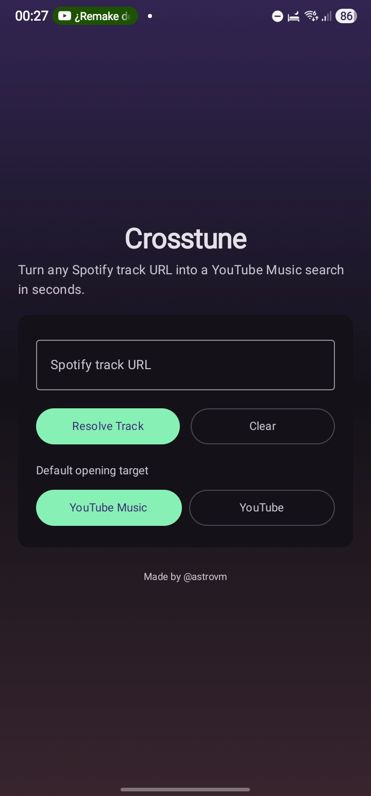
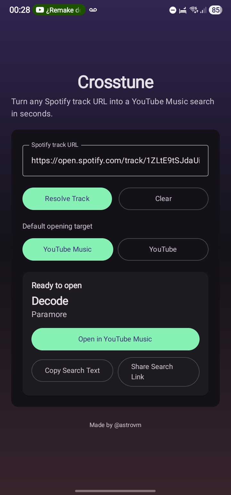

# Crosstune

Crosstune opens Spotify links in the music app you actually use: YouTube Music, YouTube, Apple Music, Deezer, TIDAL or SoundCloud.

<p align="center">
  
  &nbsp;&nbsp;
  
</p>

## What You Can Do

- Open Spotify links directly in Crosstune, share them to it from another app, or paste them.
- Open songs, albums, artists and playlists.
- Choose a default destination, or turn on **Ask where to open shared links** to pick one for each link.
- Turn on **Open exact matches when possible** to open Apple Music and Deezer items directly instead of a search.
- Use the **Open copied Spotify link** Quick Settings tile or launcher shortcut to open whatever link you copied.
- Re-open recent links from the history list.
- Copy the search text or share a search link.

## Supported Links

- `https://open.spotify.com/track/...`, `/album/...`, `/artist/...` and `/playlist/...`, including localized `/intl-xx/...` links
- `https://spotify.link/...`
- `spotify:track:...` style URIs and bare track IDs (pasted or shared)

If links keep opening in your browser, use the in-app **Open Link Settings** button and enable Crosstune for supported links.

## Privacy

Crosstune has no accounts, analytics or ads. It reads a link's title and artist from Spotify's public web pages. With exact matches turned on, it also sends that title and artist to [Apple's iTunes Search API](https://performance-partners.apple.com/search-api) or [Deezer's API](https://developers.deezer.com/api) when you open in those apps. YouTube Music, YouTube, TIDAL and SoundCloud have no public search API that works without a key, so they always open a search. History stays on your device.

## Install

Download `Crosstune-vX.Y.Z.apk` from [Releases](https://github.com/astrovm/crosstune/releases), or add `https://github.com/astrovm/crosstune` to [Obtainium](https://github.com/ImranR98/Obtainium) to get updates automatically.

Release APKs are signed with this certificate (SHA-256):

```text
64:EC:D5:52:E3:4B:B4:15:8A:04:6B:DE:1B:BD:BC:C9:04:23:9D:59:33:CF:74:C4:62:B6:FD:02:A7:B0:F6:FA
```

Each release's notes repeat the fingerprint. Releases up to v1.0.6 used a different key, so uninstall v1.0.6 once before installing a newer release.

Store metadata for F-Droid and similar catalogs lives in [`fastlane/metadata/android`](fastlane/metadata/android).

## Build from Source

### Requirements

- Android SDK
- JDK 17+
- Android Studio or Gradle CLI

If building from CLI, ensure `local.properties` has your SDK path:

```properties
sdk.dir=/path/to/Android/Sdk
```

### Build

```bash
./gradlew :app:assembleDebug
```

APK output:

```text
app/build/outputs/apk/debug/app-debug.apk
```

### Install on Device (ADB)

```bash
adb install -r app/build/outputs/apk/debug/app-debug.apk
```

## Releasing

The [Release workflow](.github/workflows/release.yml) runs the unit tests, builds a minified release APK, signs it, and publishes it to a GitHub release as `Crosstune-vX.Y.Z.apk`. You can start it either way:

- Push a tag: `git tag vX.Y.Z && git push origin vX.Y.Z`
- Or run **Actions → Release → Run workflow**, pick the branch, and enter the tag. The workflow creates the tag on that commit.

It requires these repository secrets:

| Secret | Value |
| --- | --- |
| `RELEASE_KEYSTORE_BASE64` | `base64 -w0 release.keystore` |
| `RELEASE_KEYSTORE_PASSWORD` | Keystore password |
| `RELEASE_KEY_ALIAS` | Key alias |
| `RELEASE_KEY_PASSWORD` | Key password |

Keep the keystore backed up and never replace it: Android only installs updates signed with the same key. Releases after v1.0.6 use a new signing key, so v1.0.6 must be uninstalled once before installing a newer release.

## Notes

- The app uses public Spotify page metadata (no Spotify API key needed).
- If Spotify changes their page metadata format, some links may stop resolving until updated.
- Android version metadata is derived from Git at build time:
  `versionName` uses the latest tag (without a leading `v`) and adds `-dev.N` when commits exist after that tag, while `versionCode` uses total commit count.
