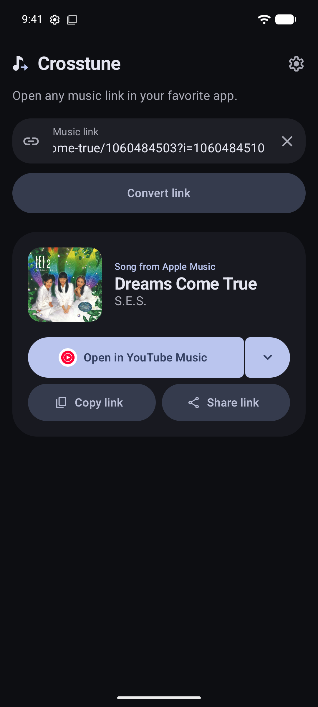
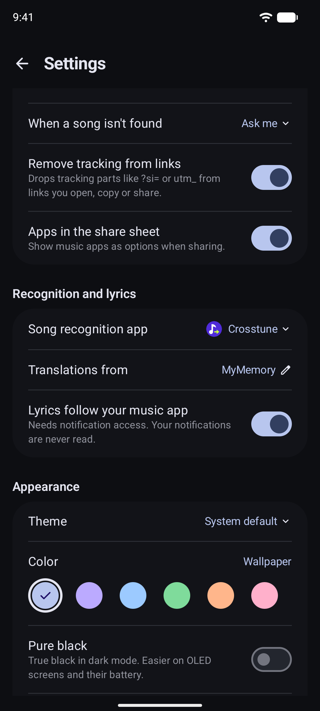
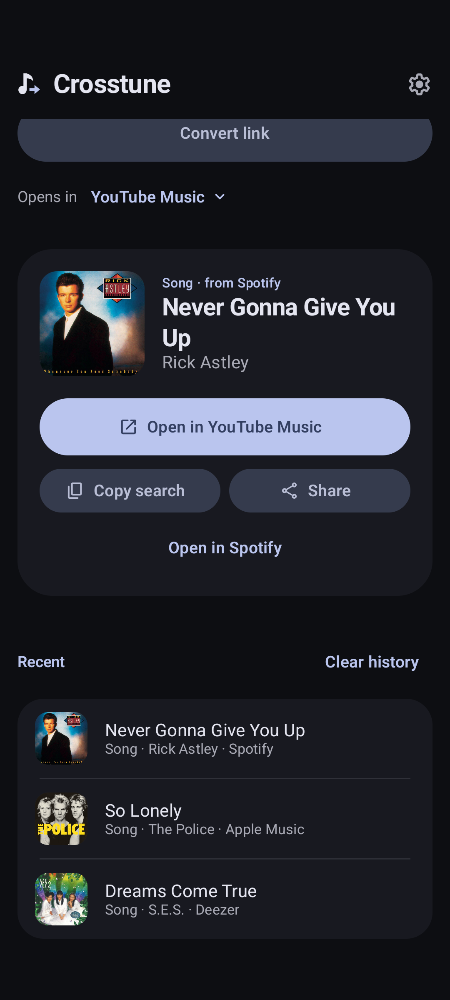

# Crosstune

**Open any music link in your favorite app.**

Got a link from one music service but listen on another? Tap it and the same song opens where you listen. Spotify to YouTube Music, Apple Music to Deezer, TIDAL to Spotify: any mix works.

<p align="center">
  
  
  
</p>

## ⬇️ Install

- Get the APK from [Releases](https://github.com/astrovm/crosstune/releases).
- Or add `https://github.com/astrovm/crosstune` to [Obtainium](https://github.com/ImranR98/Obtainium) for automatic updates.

Needs Android 8.0 or newer.

## 🚀 Set up

The app walks you through it:

1. Pick the services you get links from.
2. Pick the app you listen in.
3. Tap **Open link settings** → **Add link**, tick all the links, tap **Add**.
4. If Crosstune shows a button for an installed app like Spotify, open it and choose **In your browser** or turn off **Open supported links**.

Pasting or sharing a link to Crosstune works without any setup.

## Features

- **Tap and go.** Tapped and shared links open right away. Pasted links show the song and cover first.
- **Exact match.** Opens the song itself instead of a search, where the app supports it.
- **One app per service.** For example, YouTube links to YouTube Music and the rest to Apple Music.
- **Ask every time.** Pick the app each time you open a link.
- **Any app or site.** Add your own with a search URL like `https://example.com/search?q={query}`.
- **Shortcuts.** One-tap paste, recent links, a Quick Settings tile, and a long-press shortcut on the app icon.
- **No tracking.** Drops tracking bits like `?si=` from links. You can turn it off.
- **15 languages.** Follows your phone, or pick one in Settings.

## Supported links

| Service | Reads | Exact match |
| --- | --- | --- |
| Spotify | Songs, albums, artists, playlists, `spotify.link`, `spotify:` URIs, track IDs | Search |
| YouTube Music | Songs and videos | Songs, albums, artists |
| YouTube | Videos, Shorts, live streams, `youtu.be` | Songs |
| Apple Music | Songs, albums, artists, playlists | Songs, albums, artists |
| Deezer | Songs, albums, artists, playlists, `link.deezer.com` | Songs, albums, artists |
| TIDAL | Songs, albums, artists, playlists | Search |
| SoundCloud | Tracks, artists, sets, `on.soundcloud.com` | Search |
| Bandcamp | Tracks, albums | Songs, albums |
| Amazon Music | Can't read its links | Search |

Songs can open in any of these. "Search" means Crosstune opens a search for the title and artist.

## 🛠️ Troubleshooting

**Links still open in another app.**
Turn the service on in Crosstune's **Settings → Open links from**. Then in Android, go to **Settings → Apps → Crosstune → Open by default → Add link** and turn on its links.

**A link opened in its own app.**
It isn't a song, album, artist or playlist (a SoundCloud feed, for example), so Crosstune passes it on.

**I got a search, not the song.**
Check that **Open the exact match** is on. If it is, there was no confident match, so Crosstune searched instead.

## Privacy

- No account, analytics or ads.
- History stays on your device.
- Crosstune only asks the service a link comes from for its title, artist and cover.
- With exact match on, the title and artist also go to the search of the app it opens in ([Apple](https://performance-partners.apple.com/search-api), [Deezer](https://developers.deezer.com/api), or the YouTube Music, YouTube and Bandcamp website search).

Full [privacy policy](https://crosstune.4st.li/privacy/).

<details>
<summary><b>Verify your download</b></summary>

Release APKs are signed with this certificate. Its SHA-256 fingerprint is also listed on each release:

```text
64:EC:D5:52:E3:4B:B4:15:8A:04:6B:DE:1B:BD:BC:C9:04:23:9D:59:33:CF:74:C4:62:B6:FD:02:A7:B0:F6:FA
```

</details>

<details>
<summary><b>Building from source</b></summary>

You need the Android SDK and JDK 17 or newer. When building from the command line, set `sdk.dir=/path/to/Android/Sdk` in `local.properties`.

```bash
./gradlew :app:assembleDebug   # APK in app/build/outputs/apk/debug/
./gradlew :app:ci              # the same checks CI runs
```

`:app:ci` runs the Robolectric tests with a 100% line coverage gate, lint, and the debug and minified release builds. Reports go to `app/build/reports/`.

The version is set explicitly in `app/build.gradle.kts`: `versionName` is `X.Y.Z`, and `versionCode` is `X*1000000 + Y*10000 + Z*100`. Builds use these values even without Git history or tags. F-Droid's update checker reads the same metadata.

### Releasing

1. Update `versionName` and `versionCode` in `app/build.gradle.kts`, and add the changelog under `fastlane/metadata/android/en-US/changelogs/<versionCode>.txt`. Commit and merge these changes before releasing.
2. Push a tag with `git tag vX.Y.Z && git push origin vX.Y.Z`, or run **Actions → Release → Run workflow**.
3. The [Release workflow](.github/workflows/release.yml) runs the CI checks, verifies that the APK's version matches the tag, then signs and publishes `Crosstune-vX.Y.Z.apk`.
4. For Google Play, download the signed App Bundle `Crosstune-vX.Y.Z.aab` from the workflow run's **Crosstune-vX.Y.Z-play** artifact and upload it in Play Console. It's signed with the same key, which Play uses as the upload key.

It needs these repository secrets:

| Secret | Value |
| --- | --- |
| `RELEASE_KEYSTORE_BASE64` | Output of `base64 -w0 release.keystore` |
| `RELEASE_KEYSTORE_PASSWORD` | Keystore password |
| `RELEASE_KEY_ALIAS` | Key alias |
| `RELEASE_KEY_PASSWORD` | Key password |

> Back up the keystore and never replace it. Android only installs an update if it's signed with the same key.

Store listing text lives in [`fastlane/metadata/android`](fastlane/metadata/android).

The website at [crosstune.4st.li](https://crosstune.4st.li) is built from [`site/`](site): templates plus one strings file per language. After changing it, run `python3 scripts/build-site.py` and commit `docs/` too.

</details>
